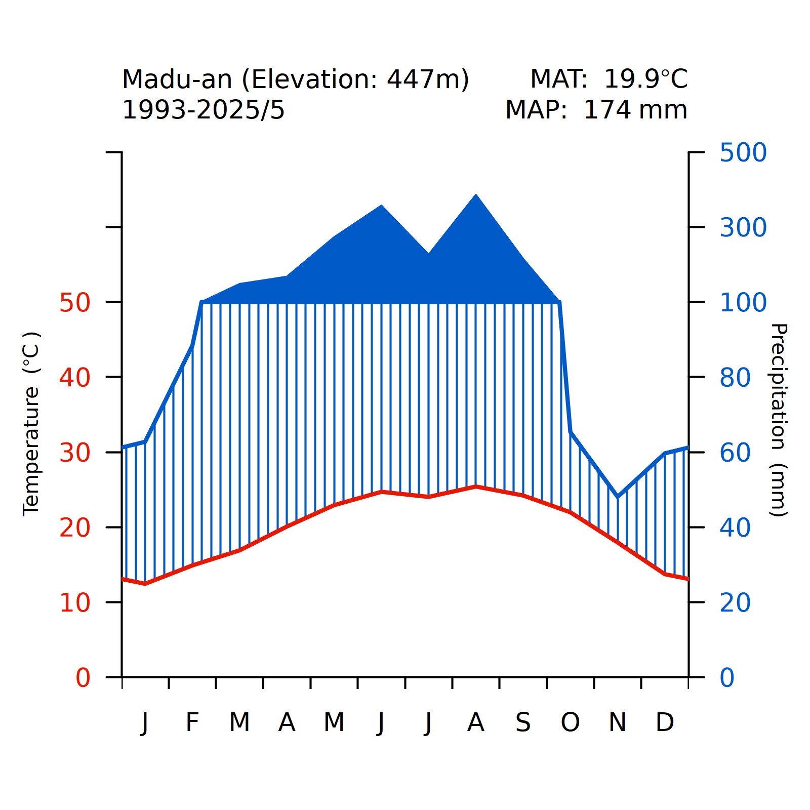

# Climate Daigram 生態氣候圖（排版更改）

# Background

用R繪製生態氣候圖時，需要使用climatol package 中的diagwl function，但因為執行時有地方出現bug，所以直接對diagwl程式碼修改bug處，並更改版面配置。
又繪製前需要資料處理，而之前資料處理是使用python，但為了方便所以轉成同一個R檔案執行，不過作者本人對R比較不熟，所以為了節省時間請chatgpt幫我轉成Ｒ。
若有疏漏或錯誤之處，敬請包涵並不吝指正！若為需求不符請自行編譯。


# 資料說明

- 這個程式檔的生態氣候圖資料處理，是以[CODIS氣候觀測資料查詢服務](https://codis.cwa.gov.tw/StationData)下載之資料為主
- 在跑程式前需要把下載的資料放在data這個資料夾中
- MAT :年均溫
- MAP :年均降雨量

# 程式範例

```
exportClimateDiagram <- function(climdata, station_name, filename, elevation, per) {
  ＃要放圖片的路徑
  setwd("~/Documents/Ｒexample/生態氣候圖")
  #字體設定
  CairoFonts(regular = "Noto Sans T Chinese:style=Light", bold = "Noto Sans T Chinese:style=Regular")
  par(family="BiauKaiTC-Regular")
  # Set output as PNG image 
  Cairo(1600,1600,file= filename, type='png',bg="white",dpi=300)
  diagwl_new(climdata, stname = station_name, 
             alt = elevation, mlab = 'en', per = per, cols = NULL)
  dev.off()
}

# station "Madu-an"
dataHandling('Madu-an', "Xuejian.png", '447', '1993-2025/5')
```
輸出



# 建置環境
macOS 14.6 


